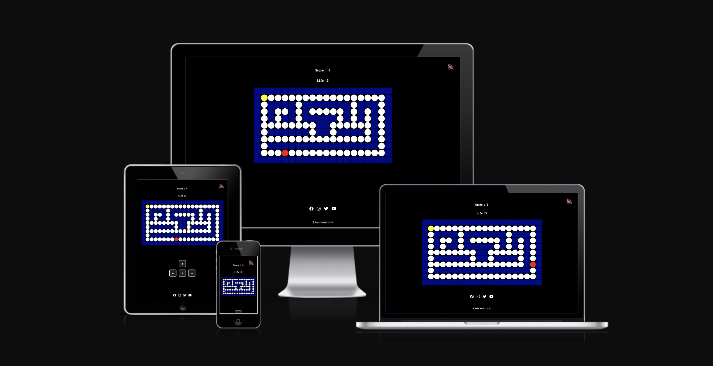
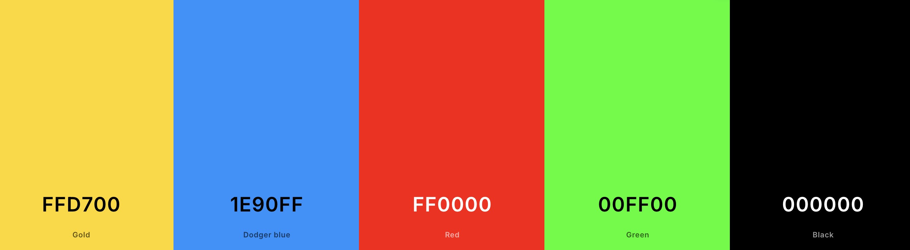
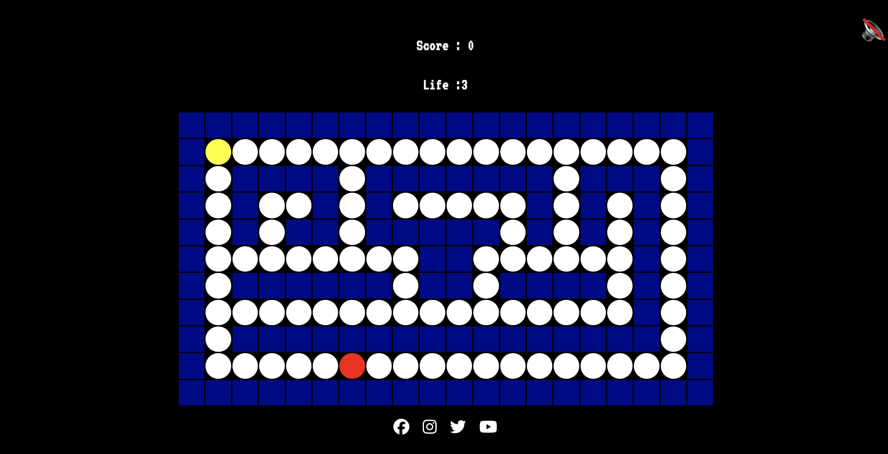
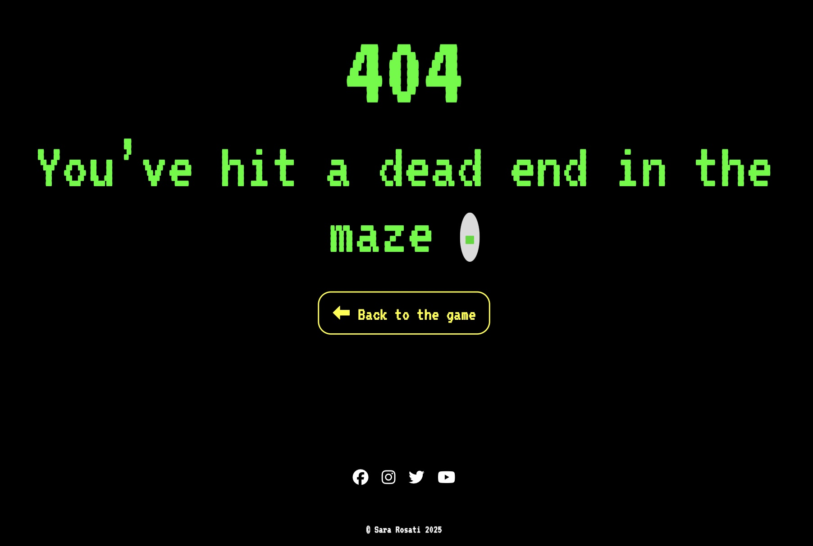
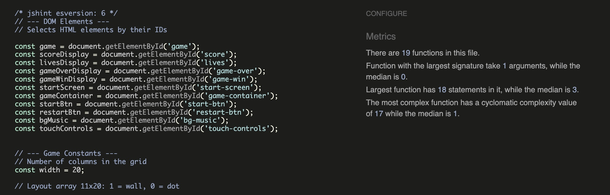
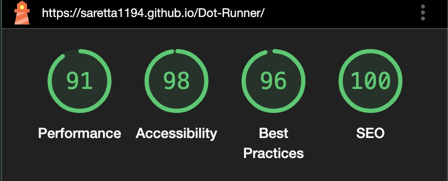

# Dot-Runner

Visit the deployed site: [Dot-Runner](https://saretta1194.github.io/Dot-Runner/)

I decided to create a game after learning JavaScript. During that time, I came up with the idea of recreating one of the most addictive games from my youth. I vividly remember spending countless hours playing it on arcade machines and early consoles. That’s when I decided to build my own version of Pac-Man.

The goal of the game is to be fun and engaging, while also bringing back nostalgic memories for those who grew up with classic video games.

## CONTENTS

 - [Design and User Experience](#design-and-user-experience)
    - [Design](#design)
  - [Features](#features)
    - [Footer](#footer)
    - [Game Page](#game-page)
  - [Testing](#testing)
    - [Tests](#tests)
    - [Validator Testing](#validator-testing)
    - [Fixed Bugs](#fixed-bugs)
    - [Unfixed Bugs](#unfixed-bugs)
    - [Performance](#performance)
  - [Deployment](#deployment)
    - [Live Website](#live-website)
  - [Credits](#credits)
    - [Content](#content)
    - [Media](#media)
  - [Technologies used](#technologies-used)

## Design and User Experience

### Design
The design focuses on simplicity and retro vibes. The layout is responsive, working well across different devices and screen sizes. A pixelated character and maze-style grid help recreate the arcade aesthetic of classic games.

Key elements:

Bold colors for high visibility

Intuitive UI with clear controls

Minimal distractions to focus on gameplay

Fonts: VT323 - This font is visible throughout the structure of the site.
Google Fonts was used to import the chosen fonts for use in the site.

Colours:

The following colors were used to give Dot Runner a clean, vibrant retro-inspired look:

Color | Hex Code | Usage
- 🟡 Yellow | #FFD700 | Player character (Dot Runner)
- 🔵 Blue | #1E90FF | Maze walls / borders
- ⚫ Black | #000000 | Background
- ⚪ White | #FFFFFF | Dots to collect
- 🔴 Red | #FF0000 | Enemy characters
- 🟢 Green | #00FF00 | Win message / status text

These colors were chosen to ensure high contrast and visual clarity, especially for fast-paced gameplay.

## Features

The website is comprised of a home page and a 404 error page.

All Pages on the website are responsive and have:

* A favicon in the browser tab 

### Footer

- Present on all pages.
- Contains links to social media (if applicable) or credits.
- Stays fixed at the bottom without overlapping with the game grid or touch controls.
- When clicking on the social links, it opens in a new tab.

### Game Page

- __StartButton__

The  page contains a big bottom starting:
- Clicking is a means for the user to begin playing.

- Interactive and dynamic game grid.

! [Game grid small device](assets/images/small%20devices.jpg)
- Touch controls shown only on small-screen devices.

- Background music with an on/off toggle button.

- Smooth and responsive gameplay across devices.

### 404 Error Page

- On the 404 error page, you can find the 404 error numbers with a small color animation. Next we find the page not found information.
- In the message Return to home page, if the user clicks on it, they will be redirected to the home page.

## Testing

To test my game I have opened it on different devices, to see if it was working as expected.

- Browser tested:
  - Chrome
  - Firefox
  - Safari

- Operating systems:
  - Android
  - iOS

  ### Tests

  

  
General

  |Action | Expected behavious | Result|
  |-------|--------------------|-------|
  |Copy url of the browser and paste it in browser. Press enter | Browser should load index.html | Pass |
  |Scale up the window | The contentent should not stretch over a certain size | Pass |
  |Scale down the window | The contentent should be visible without having to scroll horizontally | Pass |

  

  

  
Footer

  |Action | Expected behavious | Result|
  |-------|--------------------|-------|
  |Click on the LinkedIn icon in the footer | It should open LinkedIn in a new tab | Pass |
  |Click on the TikTok icon in the footer | It should open Facebook in a new tab | Pass |
  |Click on the Youtube icon in the footer | It should open Facebook in a new tab | Pass |
  |Click on the GitHub icon in the footer | It should open Facebook in a new tab | Pass |

  

  

  
Game

  | Action | Expected Behavior | Result |
  |--------|-------------------|--------|
  | When you press the navigation keys on the keyboard, the dot should start to move | Pass |
  | When you press the navigation keys on the keyboard, the dot will move in the direction of the arrow key pressed | Pass |
  | When the dot touch 3 times the red dot finish the lives and the Game Over alert should appear | Pass |
  | When the dot take all the white dot the You Win alert should appear| Pass

### Validator Testing

- HTML
  - No errors were returned when passing the final version through the official [W3C validator](https://validator.w3.org/nu/#textarea)
  - 
- CSS
  - No errors were found when passing the final version through the official [(Jigsaw) validator](https://jigsaw.w3.org/css-validator/validator)
  -  

- JAVA SCRIPT 
- No errors were found [JSHint ](https://jshint.com/)
-

### Fixed Bugs

### Unfixed Bugs

### Performance

I have tested the performance in chrome, using lighthouse:

- Performance rate:

   

## Deployment

### Live Website

- The site was deployed to GitHub pages. The steps to deploy are as follows:
  - In the GitHub repository, navigate to the Settings tab
  - From the Code and automation section drop-down menu, select the Pages.
  - In the build and deployment area, choose from source "deply from a branch" and after in Branch choosse the main branch and root and save.
  - Once this is save, the page will be automatically refreshed with a detailed ribbon display to indicate the successful deployment (he take me more less 5 minutsfor appear the link).

The live link can be found here - [Live Website](https://saretta1194.github.io/Dot-Runner/)

## Credits

### Content

- Ideas and some code was taked and lerned for Dot Runner: [CodewithAniaKubow](https://www.youtube.com/watch?v=q2ViNbRwr5U),
[weibenfalk](https://www.youtube.com/watch?v=-z2Nwz9fPA8)
- The icons in the footer were taken from [Font Awesome](https://fontawesome.com/)
- The following fonts, used for the project, are from [Google Fonts](https://fonts.google.com/)

### Media

- Image for FavIcon [favicon.io](https://favicon.io)
- Sounds taken from Pixabay [Pixabay](https://pixabay.com/)

## Technologies used

- HTML
- CSS
- JS

