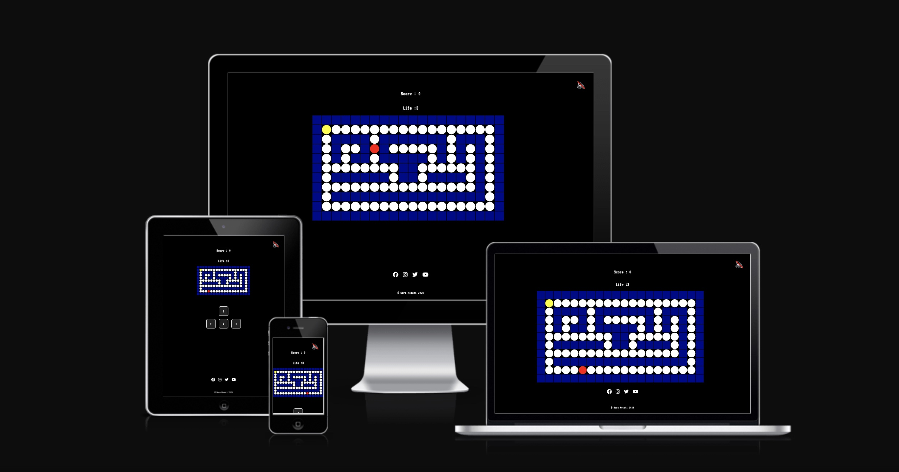

# Dot-Runner

Visit the deployed site: [Dot-Runner](https://saretta1194.github.io/Dot-Runner/)

I decided to create a game after learning JavaScript. During that time, I came up with the idea of recreating one of the most addictive games from my youth. I vividly remember spending countless hours playing it on arcade machines and early consoles. That’s when I decided to build my own version of Pac-Man.

The goal of the game is to be fun and engaging, while also bringing back nostalgic memories for those who grew up with classic video games.

## CONTENTS

 - [Design and User Experience](#design-and-user-experience)
    - [Design](#design)
  - [Features](#features)
    - [Footer](#footer)
    - [Game Page](#game-page)
  - [Testing](#testing)
    - [Tests](#tests)
    - [Validator Testing](#validator-testing)
    - [Fixed Bugs](#fixed-bugs)
    - [Unfixed Bugs](#unfixed-bugs)
    - [Performance](#performance)
  - [Deployment](#deployment)
    - [Live Website](#live-website)
  - [Credits](#credits)
    - [Content](#content)
    - [Media](#media)
  - [Technologies used](#technologies-used)

## Design and User Experience

### Design
The design focuses on simplicity and retro vibes. The layout is responsive, working well across different devices and screen sizes. A pixelated character and maze-style grid help recreate the arcade aesthetic of classic games.

Key elements:

Bold colors for high visibility

Intuitive UI with clear controls

Minimal distractions to focus on gameplay

Fonts: VT323 - This font is visible throughout the structure of the site.
Google Fonts was used to import the chosen fonts for use in the site.

Colours:

The following colors were used to give Dot Runner a clean, vibrant retro-inspired look:

Color | Hex Code | Usage
🟡 Yellow | #FFD700 | Player character (Dot Runner)
🔵 Blue | #1E90FF | Maze walls / borders
⚫ Black | #000000 | Background
⚪ White | #FFFFFF | Dots to collect
🔴 Red | #FF0000 | Enemy characters
🟢 Green | #00FF00 | Win message / status text

These colors were chosen to ensure high contrast and visual clarity, especially for fast-paced gameplay.

## Features

